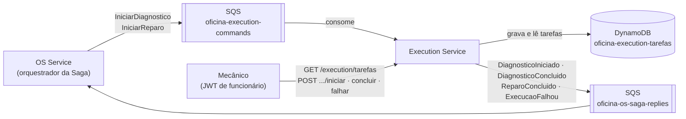

# Execution Service

Fila de diagnóstico e reparo das ordens de serviço.

Microsserviço do Tech Challenge da Fase 4 (FIAP SOAT): a oficina mecânica dividida em OS Service, Billing Service e Execution Service, com a Saga orquestrada pelo OS Service. Os contratos de mensagens e rotas entre os serviços estão em [docs/contratos.md](https://github.com/LucasValada/tech-challenge-fiap/blob/develop/docs/contratos.md).

## Responsabilidades

- Gerenciar a fila de execução da OS (diagnóstico e reparo)
- Atualizar o status durante o diagnóstico e os reparos
- Comunicar a finalização ao OS Service

## Como funciona



1. O OS Service publica `IniciarDiagnostico` (na abertura da OS) ou `IniciarReparo` (depois do pagamento). O serviço consome o comando e coloca a tarefa na fila do mecânico, como `PENDENTE`.
2. O mecânico lista a fila e age sobre a tarefa. Cada ação que interessa à Saga publica uma resposta para o orquestrador:

| Ação | Diagnóstico | Reparo |
|---|---|---|
| `POST /execution/tarefas/{id}/iniciar` | `DiagnosticoIniciado` (a OS vai para `EM_DIAGNOSTICO`) | — |
| `POST /execution/tarefas/{id}/concluir` | `DiagnosticoConcluido` (o OS pede o orçamento) | `ReparoConcluido` (a OS é finalizada) |
| `POST /execution/tarefas/{id}/falhar` | `ExecucaoFalhou` (o OS compensa) | `ExecucaoFalhou` (o OS compensa, com estorno) |

Ciclo de uma tarefa: `PENDENTE → EM_ANDAMENTO → CONCLUIDA`, ou `FALHOU` a partir de `PENDENTE` ou `EM_ANDAMENTO`. Ação fora dessa ordem responde 409 e não publica nada.

### Garantias

- **Banco próprio.** As tarefas ficam no DynamoDB deste serviço (o banco NoSQL do projeto). Os dados da OS (código, veículo, serviços e itens) chegam no comando; o serviço nunca consulta o banco do OS Service.
- **Comando repetido não duplica tarefa.** O SQS entrega pelo menos uma vez. O id da tarefa é um UUID v5 da OS e do tipo, e a gravação é condicional (`attribute_not_exists(id)`): a segunda entrega é recusada e dada como processada.
- **Comando inválido é falha de negócio.** Responde `ExecucaoFalhou` com `COMANDO_INVALIDO`, para o orquestrador compensar, em vez de ficar voltando para a fila.
- **Falha técnica volta para a fila.** A mensagem só é apagada depois de processada; se o processamento falha, o SQS reenvia e, depois de 5 tentativas, a move para a DLQ `oficina-execution-commands-dlq`.
- **Publica antes de gravar.** Se a publicação da resposta falha, a tarefa não muda e a ação pode ser repetida.
- **Rastreamento.** As linhas de log do consumo carregam o `correlationId` e a OS do fluxo, os mesmos do OS e do Billing, para acompanhar uma OS nos três serviços pelo New Relic.

## Tecnologias

NestJS 11 · TypeScript · Node.js 24 · Amazon SQS · Amazon DynamoDB · AWS SDK v3 · Jest · logs JSON com `nestjs-pino` e `correlationId` · agente New Relic · Docker · LocalStack · Kubernetes (EKS) · Terraform · GitHub Actions

## Rodando localmente

Com Docker (recomendado), o LocalStack simula o SQS e o DynamoDB com as mesmas filas e tabela do Terraform:

```bash
cp .env.example .env    # ajuste JWT_SECRET para o mesmo segredo do OS Service
docker compose up --build
```

- Saúde: `http://localhost:3002/execution/health` e `http://localhost:3002/execution/health/ready`
- Swagger: `http://localhost:3002/execution/api`

Sem Docker para o serviço (o LocalStack ainda é necessário): `docker compose up -d localstack`, depois `npm ci && npm run start:dev` (porta 3000).

## Variáveis de ambiente

| Variável | Uso |
|---|---|
| `JWT_SECRET` | Mesmo segredo do OS Service e da Lambda de autenticação |
| `AWS_REGION` | Região da AWS |
| `EXECUTION_COMMANDS_QUEUE_URL` | Fila consumida |
| `SAGA_REPLIES_QUEUE_URL` | Fila das respostas para o orquestrador |
| `DYNAMODB_TABLE_TAREFAS` | Tabela de tarefas |
| `AWS_ENDPOINT_URL` | Só localmente, aponta para o LocalStack |

## Testes

```bash
npm test            # testes unitários
npm run test:cov    # com cobertura; falha abaixo de 80% de linhas e instruções
```

## Estrutura

```
src/
  common/
    aws/            clientes do SQS e do DynamoDB
    mensageria/     envelope, consumidor e publicador SQS
    observability/  New Relic, eventos de log e contexto do fluxo
  core/config/      validação das variáveis de ambiente e prefixo das rotas
  modules/tarefa/
    domain/         tarefa, ciclo de estados, id determinístico, erros
    application/    casos de uso (receber comando, transicionar, consultar)
    interface/      controller REST e consumidor da fila de comandos
    infra/          repositório no DynamoDB
k8s/                namespace, ConfigMap, Deployment, Service, HPA, Ingress e PDB
terraform/          fila, DLQ, tabela, ECR e permissões
localstack/         criação das filas e da tabela no LocalStack
```

## Deploy

Os manifestos ficam em `k8s/`. O Ingress compartilha o ALB dos três serviços (`group.name: oficina`) e encaminha `/execution` para este serviço. O pipeline de deploy no EKS entra na etapa de integração do plano de ação.

A infraestrutura AWS do serviço (fila, banco, repositório de imagens e permissões) está em [`terraform/`](terraform/README.md).
